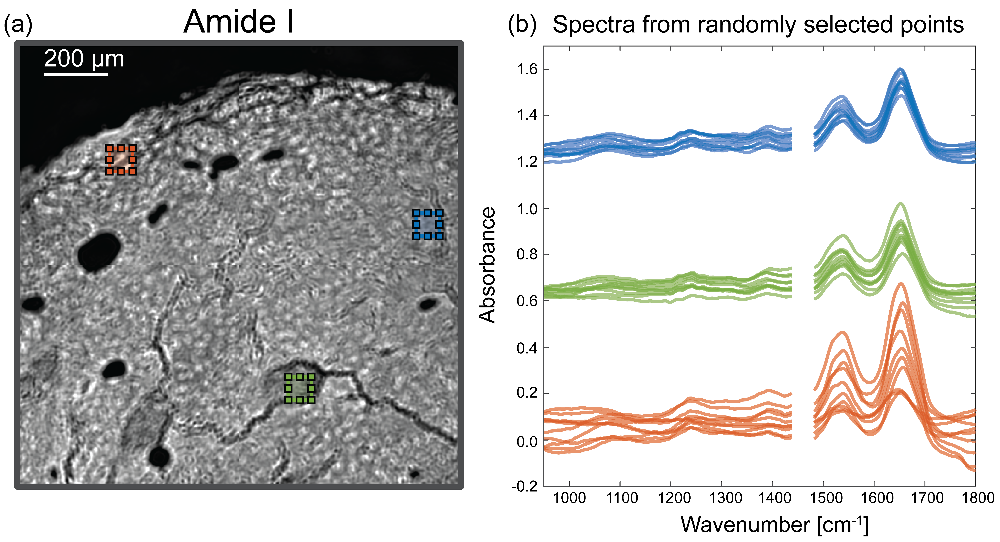

# Machine Learning-Assisted Mid-Infrared Spectrochemical Fibrillar Collagen Imaging
**Authors:** Wihan Adi, Bryan E. Rubio Perez, Yuming Liu, Sydney Runkle, Kevin W. Eliceiri, Filiz Yesilkoy  
**Published in:** Journal of Biomedical Optics (2024)  
**DOI:** [10.1117/1.JBO.29.9.093511](https://doi.org/10.1117/1.JBO.29.9.093511)

## 🔬 Summary
This study presents a **machine learning-assisted multimodal imaging method** combining **mid-infrared spectral imaging (MIRSI)** and **second harmonic generation (SHG) microscopy** to identify **fibrillar collagen** in biological tissues. The model achieves:
- **80% boundary F-score** in collagen segmentation
- **0.82 Pearson’s correlation** in collagen orientation
  

## 📜 Contents
- `ML_Assisted_MidIR_Collagen_Imaging.pdf` → Full research paper
- `code/` → MATLAB scripts for ML model training and data preprocessing
- `figures/` → Key figures and result plots


## 🧬 Scientific background
Collagen morphology is cancerous tissues changes as cancer progresses. This is the so called tumor associated collagen signature (TACS), which plays an important role in cancer progression, 
and can be used as a biomarker to determine cancer stages. 
MIRSI is a relatively new imaging technique that can provide chemical signal of sample. In this study, we do imaging of tissues using MIRSI to do a preliminary study of the chemical signal of collagen.
For this, the collagen spectra needs to be labelled to differentiate collagen from non-collagen. The ground truth label comes from SHG image of the identical tissue. Given that the chemical spectra is complex and multidimensional, 
we used Random Forest to identify key differentatiors between collagen and non-collagen and interpret the results. 

The overview of this study is illustrated in the following figure.

## Data preprocessing
An example of MIRSI data is shown in the following figure.  

The spectra is pre-processed using PCA for noise reduction, where PCA was performed and reprojected back to the original basis, but only including the first 40 principal components. 


```
code\preprocessSpectra.mlx
```

## Training the random forest 


## Validation


## 📌 Citation
```bibtex
@article{adi2024mlmirsi,
  author = {Wihan Adi et al.},
  title = {Machine Learning-Assisted Mid-Infrared Spectrochemical Fibrillar Collagen Imaging},
  journal = {JBO},
  year = {2024},
  doi = {10.1117/1.JBO.29.9.093511}
}
