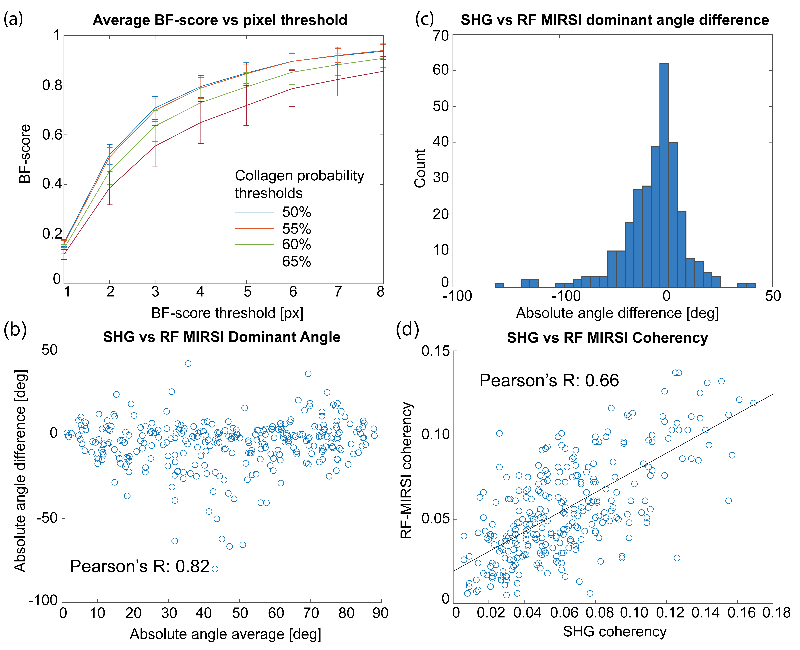
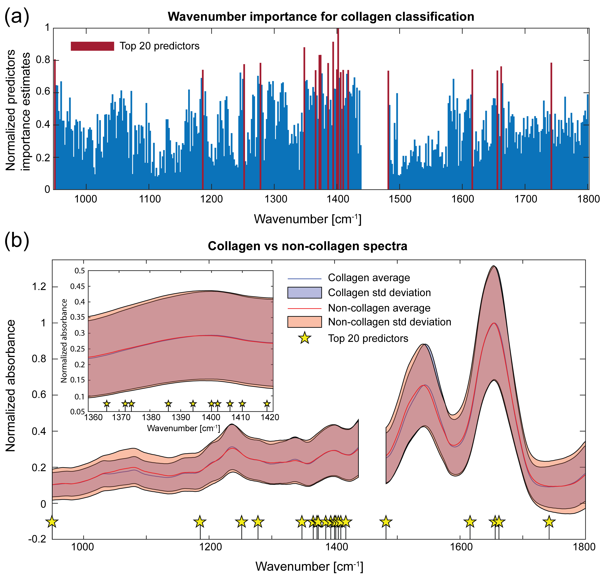

# Machine Learning-Assisted Mid-Infrared Spectrochemical Fibrillar Collagen Imaging
**Authors:** Wihan Adi, Bryan E. Rubio Perez, Yuming Liu, Sydney Runkle, Kevin W. Eliceiri, Filiz Yesilkoy  
**Published in:** Journal of Biomedical Optics (2024)  
**DOI:** [10.1117/1.JBO.29.9.093511](https://doi.org/10.1117/1.JBO.29.9.093511)

## 🔬 Summary
This study presents a **machine learning-assisted multimodal imaging method** combining **mid-infrared spectral imaging (MIRSI)** and **second harmonic generation (SHG) microscopy** to identify **fibrillar collagen** in biological tissues. The model achieves:
- **80% boundary F-score** in collagen segmentation
- **0.82 Pearson’s correlation** in collagen orientation
  

## 📜 Contents
- `ML_Assisted_MidIR_Collagen_Imaging.pdf` → Full research paper
- `code/` → MATLAB scripts for ML model training and data preprocessing
- `figures/` → Key figures and result plots

## Data
the data can be found [here](https://drive.google.com/drive/folders/14eXJC-Hmc4882gPiHnwWszhHrrMk-6DJ?usp=sharing).

## 🧬 Scientific background
Collagen morphology is cancerous tissues changes as cancer progresses. This is the so called tumor associated collagen signature (TACS), which plays an important role in cancer progression, 
and can be used as a biomarker to determine cancer stages. 
MIRSI is a relatively new imaging technique that can provide chemical signal of sample. In this study, we do imaging of tissues using MIRSI to do a preliminary study of the chemical signal of collagen.
For this, the collagen spectra needs to be labelled to differentiate collagen from non-collagen. The ground truth label comes from SHG image of the identical tissue. Given that the chemical spectra is complex and multidimensional, 
we used Random Forest to identify key differentatiors between collagen and non-collagen and interpret the results. 

The overview of this study is illustrated in the following figure.

## Data preprocessing
An example of MIRSI data is shown in the following figure.  

The spectra is pre-processed using PCA for noise reduction, where PCA was performed and reprojected back to the original basis, but only including the first 40 principal components. 


```
code\preprocessSpectra.mlx
```

SHG data acquired using identical tissue samples are used to label the spectra to differentiate collagen from non-collagen. 
Because they were acquired using different optical setups, they have different specifications and need to be co-registered. 
The registration is done using [a registration method from MATLAB](https://www.mathworks.com/help/images/find-image-rotation-and-scale.html) 
and is done by determining the inverse affine transform given a set of paired landmarks. The set of paired landmarks are chosen manually.


```
code\registerFOV.mlx
```

## Training the random forest 
Once the spectra of collagen and non-collagen are obtained, the random forest algorithm can be trained. Here the TreeBagger class from MATLAB was used. The parameters used can be found in the code. 

```
code\trainRF.mlx
```
Once trained, the RF model is used to calculate the probability of collagen for each MIRSI spectra from the validation set. The spectra is then assigned a probability of how likely it is to come from a collagen. 
We used a threshold of >50% to determine whether a spectra contains a collagen or not. This approach produces a lot of noise, but we are including the maximum amount of collagen. After the collagen determination has 
been done to all pixels, essentially we have generated a collagen distribution image from the MIRSI data. The noisy collagen data that is not coming from a larger mass (e.g. a fiber) is omitted,
because we are focusing only on fibrillar collagen. 

```
code\denoisingMIRSI.mlx
```

An example of the final result is as illustrated in the following figure. 


## Validation
 Now that we can generate collagen distribution from our MIRSI data, we need to validate the results. The validation is done using [boundary F-score](https://www.mathworks.com/help/images/ref/bfscore.html), 
 fiber dominant direction, and alignment between the SHG ground truth and the generated RF-MIRSI images.  The dominant direction and alignment are calculated using [OrientationJ](https://bigwww.epfl.ch/demo/orientation/). 
 The overall result is shown in the following figure. 



We can see in (a) that the BF-score yields high score (>0.8) when we give a pixel tolerance of at least 4, which is reasonable given registration mismatch between the two modalities. Values are also calculated 
for different collagen probability threshold, and it can be seen that the score is the highest when we keep the lowest probability threshold (>50%) as it keeps the maximum amount of collagen pixel. The difference in dominant direction between the RF-MIRSI and the corresponding SHG has a mean around 0 degree (b) and has Pearson's R of 0.82 (c), which indicates high correlation. Similarly, alignment correlation between the two modalities is also positive (Pearson's R 0.66, d). 

## Spectra interpretation 
Now that we are confident about our model's ability to segment collagen from non-collagen in the tissue, we can inspect the training spectra and the predictor importance that our model gives us. 
The predictor importance is calculated by removing a feature (in this case a wavenumber) from the model and compare it with the model that still include the feature. The more important a feature is, 
the more error the model will have when it is removed. Then everything is normalized to the maximum value across all features; see (a) in the figure below. 



It is interesting to see many important features aggregate around 1360 to 1420. When we see the average spectra and their standard deviations for collagen vs non-collagen from the training data. On average the data is actually very similar between them in that region. This leads us to hypothesize that there is something of biochemical importance in that region, and seems like hydroxy-proline, an amino acide with high abundance (~22%) in collagen, has strong IR features in there. More discussion can be found in the paper. 

## 📌 Citation
```bibtex
@article{adi2024mlmirsi,
  author = {Wihan Adi et al.},
  title = {Machine Learning-Assisted Mid-Infrared Spectrochemical Fibrillar Collagen Imaging},
  journal = {JBO},
  year = {2024},
  doi = {10.1117/1.JBO.29.9.093511}
}
