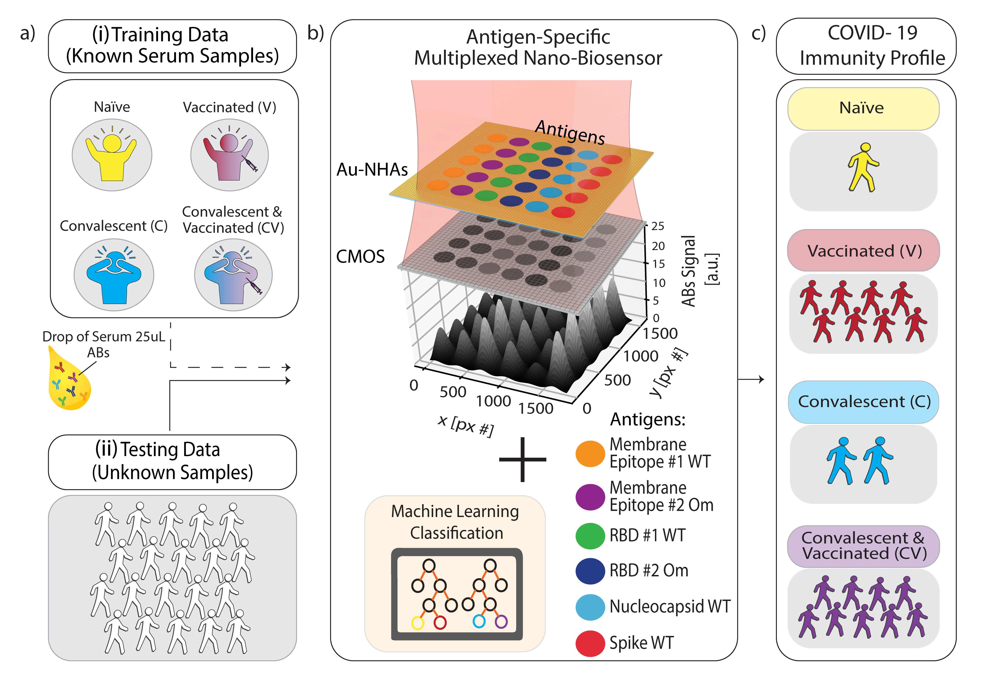

# COVID-19 Immunity Profiling using Random Forest and Nanoplasmonic Sensor

## Overview
This repository contains a **Jupyter Notebook** implementing a **Random Forest classifier** for immunity profiling in **COVID-19 screening**. The code classifies **unknown samples** into predefined immunity categories using **known sample data** from `.csv` files.

This work is based on the following publication:

🔗 **[Machine-learning-aided multiplexed nanoplasmonic biosensor for COVID-19 population immunity profiling](https://pubs.rsc.org/en/content/articlehtml/2023/sd/d3sd00081h)** (RSC Sensor & Diagnostics, 2023)

## Project Workflow
The notebook follows these key steps:
1. **Load Data**: Reads processed `.csv` files containing labeled and unknown sample data.
2. **Train Random Forest Model**: Initializes and fits a **Random Forest classifier**.
3. **Make Predictions**: Classifies unknown samples based on trained model.

## Repository Contents
- `notebooks/` - Contains the Jupyter Notebook `immunityProfiling_COVID19Project_code.ipynb`.
- `data/` - Sample `.csv` datasets used for training and classification.
- `figures/` - Figures from the publication.

## Scientific Introduction 
During the pandemic, there was a need to quickly test immunity against COVID19 and vaccination status of a person. Our group developed a nanooptical sensor to measure immunity and vaccination status based on blood serum. The data is multidimensional and therefore needs to be evaluated using a random forest algorithm. An overview of the technology is shown in the following figure. 



## Training the random forest 
The detail about the random forest algorithm can be found in the following notebook. 

```
notebook\immunityProfiling_COVID19Project_code.mlx
```


## Validation

| Data Type                             | Infection Rate [%] (95% CI) | Vaccination Rate [%] (95% CI) | Omicron Share [%] (95% CI) |
|----------------------------------------|----------------------------|-------------------------------|----------------------------|
| **Epidemiological COVID-19 data**      | 65 (64–70)                 | 84                            | 30                         |
| **ML-aided nanobiosensor's predictions** | 55 (48–61)                 | 87 (82–92)                    | 27 (19–36)                 |


## Citation
If you use this repository, please cite the original paper:
```bibtex
@article{immunity_profiling_2023,
  author = {Beisenova, A., Adi, W., Bashar, S. J., Velmurugan, M., Germanson, K. B., Shelef, M. A., & Yesilkoy, F.},
  title = {Machine learning-based prediction of chemical properties from molecular structures},
  journal = {RSC Sensors & Diagnostics},
  year = {2023},
  url = {https://pubs.rsc.org/en/content/articlehtml/2023/sd/d3sd00081h}
}
```

